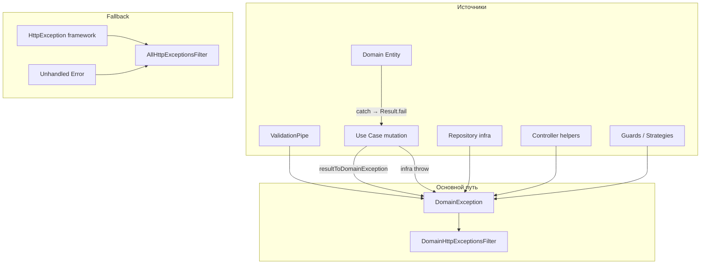

# nest-incubator

REST API на [NestJS](https://nestjs.com/) для учебного проекта **it-incubator**. Бэкенд работает с **PostgreSQL** ([TypeORM](https://typeorm.io/)), использует модульную архитектуру и покрывает домены: аутентификация, управление устройствами и сессиями, пользователи, блоги, посты, комментарии, email-уведомления.

Основные модули: `auth`, `security`, `user`, `post`, `blog`, `comment`, `like`, `session`, `email`, `testing`. Swagger доступен по пути `/api` (в development — также статика на `/`).

## Архитектура

Проект организован как **modular monolith**: в корне `src/` три слоя — `app`, `core`, `modules`. Точка входа `main.ts` остаётся в корне `src/`.

```
src/
├── main.ts                 # bootstrap NestJS-приложения
├── app/                    # composition root: сборка модулей, глобальные настройки HTTP
├── core/                   # переиспользуемый код без доменной логики
└── modules/                # feature-модули (домены)
```

### `app/` — composition root

Содержит `AppModule` и всё, что относится к **запуску и склейке** приложения:

| Файл                                   | Назначение                                                                                                             |
| -------------------------------------- | ---------------------------------------------------------------------------------------------------------------------- |
| `app.module.ts`                        | Регистрация feature-модулей, глобальных провайдеров (Config, TypeORM, Mailer)                                          |
| `app.settings.ts`                      | `configApp` — глобальные pipes (через `core/pipes/pipes.setup.ts`), CORS, Swagger, init; вызывается из `main.ts` и e2e |
| `app.controller.ts` / `app.service.ts` | Корневой health-check эндпоинт                                                                                         |

**Состав `AppModule`** (глобальная инфраструктура помимо feature-модулей):

| Регистрация                                             | Назначение                                     |
| ------------------------------------------------------- | ---------------------------------------------- |
| `ScheduleModule.forRoot()`                              | Cron-планировщик (очистка просроченных сессий) |
| `ThrottlerModule.forRoot({ ttl: 10, limit: 5 })`        | Rate limiting: 5 запросов за 10 секунд на IP   |
| `{ provide: APP_GUARD, useClass: ThrottlerGuard }`      | Глобальный throttling для всех маршрутов       |
| `CqrsModule.forRoot()`, `TypeOrmModule`, `MailerModule` | CQRS, PostgreSQL, SMTP                         |

`app/` импортирует `modules/*` и `core/*`, но **не содержит бизнес-логики** доменов.

### `core/` — общий код

Инфраструктурные и cross-cutting вещи, которые используются в нескольких модулях и **не зависят от конкретного домена**:

```
core/
├── application/            # BcryptService
├── exceptions/             # DomainException, коды ошибок, Extension
├── filters/                # DomainHttpExceptionsFilter, AllHttpExceptionsFilter
├── result/                 # Result Object (ok/fail, resultToDomainException)
├── pipes/                  # setupValidationPipe (глобальный ValidationPipe)
├── constants/              # pagination defaults (DEFAULT_PAGE_NUMBER, …)
├── decorators/             # param- и validation-декораторы общего назначения
├── dto/                    # BaseQueryParamsDto, PaginatedViewDto
├── types/                  # общие типы и enum'ы (Paginator, SortDirections, LikeStatus)
├── validators/             # class-validator constraints + Injectable-валидаторы
├── utils/                  # утилиты (helpers, error-formatter, throw-if-not-found, typeorm-pagination)
├── core.config.ts          # CoreConfig
└── core.module.ts          # CoreModule (@Global)
```

**Правило:** код в `core/` не импортирует из `modules/*`. Если декоратор или валидатор нужен только одному модулю — он живёт внутри этого модуля (например, `modules/auth/decorators/`).

### `modules/` — feature-модули

Каждый модуль — изолированный домен с собственным `@Module`, контрактом через `exports` и типичной внутренней структурой:

```
modules/<feature>/
├── api/                    # controllers, HTTP-слой (CommandBus / QueryBus)
├── application/
│   ├── commands/           # CQRS command + thin @CommandHandler
│   ├── queries/            # CQRS query + thin @QueryHandler
│   ├── use-cases/          # *UseCase с методом execute()
│   └── services/           # application services (JWT, hashing и т.п.)
├── domain/
│   ├── entities/           # rich domain entities (create, reconstitute, toDb, business methods)
│   └── mappers/            # *PersistenceMapper — OrmEntity ↔ Entity
├── infrastructure/         # TypeORM OrmEntity, repositories, read mappers
├── dto/                    # class-validator DTO для HTTP (body и query params list-эндпоинтов)
├── models/                 # read-модели (Model) для query-репозиториев и view mappers
├── guards/ / strategies/   # при необходимости (auth)
├── decorators/             # декораторы, специфичные для модуля
└── <feature>.module.ts
```

Инфраструктурные модули (`database`, `email`) также располагаются в `modules/` — они регистрируют провайдеры и экспортируют их другим feature-модулям.

| Модуль                      | Домен                                                                  |
| --------------------------- | ---------------------------------------------------------------------- |
| `auth`                      | Аутентификация, JWT, Passport strategies                               |
| `security`                  | Управление устройствами и сессиями текущего пользователя               |
| `user`                      | Пользователи                                                           |
| `blog` / `post` / `comment` | Контент                                                                |
| `like`                      | Reactions (subdomain, без HTTP)                                        |
| `session`                   | Сессии и refresh-токены (use-cases, без HTTP; для `auth` и `security`) |
| `email`                     | Отправка писем (SMTP, шаблоны)                                         |
| `database`                  | TypeORM, миграции, seed для локальной разработки                       |
| `testing`                   | Служебные эндпoинты для e2e                                            |

### Типы модулей

| Тип                            | Модули                                                | Обязательные папки                                                                   | HTTP / CQRS                                      |
| ------------------------------ | ----------------------------------------------------- | ------------------------------------------------------------------------------------ | ------------------------------------------------ |
| **HTTP feature** (полный CQRS) | `user`, `blog`, `post`, `comment`, `auth`, `security` | `api/`, `application/`, `dto/`, `models/`, `infrastructure/`; при domain — `domain/` | Controller → CommandBus / QueryBus               |
| **Subdomain** (без `api/`)     | `session`, `like`                                     | `application/` (use-cases или services)                                              | Use cases вызываются из feature-модулей напрямую |
| **Infra**                      | `database`, `email`                                   | config, провайдеры; у `database` — migrations/seeds                                  | Нет domain layer и HTTP                          |
| **Utility**                    | `testing`                                             | минимальный модуль под одну задачу                                                   | CQRS только для служебного cleanup               |

Subdomain-модули (`like`, `session`) экспортируют services / use cases через `@Module({ exports })`; эндпoинты и обработка HTTP-ошибок — у потребителей (`post`, `comment`, `auth`, `security`).

### Направление зависимостей

```
main.ts → app/ → modules/ → core/
                  ↓
            (не наоборот)
```

- `modules/*` может импортировать `core/*` и другие `modules/*` (через `@Module({ imports })` и прямые импорты типов)
- `core/*` **не импортирует** `modules/*`
- `app/*` собирает всё вместе, но не содержит доменной логики

Публичный контракт Nest-модуля определяется **`exports` в `@Module`**, а не barrel-файлами (`index.ts`).

### CQRS и Use Cases

Бизнес-логика доменов построена на **@nestjs/cqrs** и паттерне **Use Case**:

| Слой                | Роль                                                                                                                   |
| ------------------- | ---------------------------------------------------------------------------------------------------------------------- |
| **Controller**      | HTTP: валидация DTO, guards, вызов `commandBus.execute()` / `queryBus.execute()`                                       |
| **Command / Query** | Объект намерения + тонкий `@CommandHandler` / `@QueryHandler`, делегирующий в use case                                 |
| **Use Case**        | `application/use-cases/*UseCase`, метод `execute()` — одна операция, одна ответственность                              |
| **Domain service**  | Переиспользуемая application/инфраструктурная логика без привязки к HTTP (например `JwtTokenService`, `BcryptService`) |
| **Domain Entity**   | Rich-модель в `domain/entities/` — инварианты и бизнес-методы (`confirmEmail`, `canBeModifiedBy`, …)                   |
| **Repository**      | CUD-доступ через domain entities; query-репозитории возвращают `*Model` для read side                                  |

**Поток запроса:**

```
HTTP → Controller → CommandBus/QueryBus → Handler → UseCase.execute() → Repository / Domain Service
```

**Регистрация в модуле** — через массивы провайдеров:

```typescript
const blogUseCases = [GetBlogsUseCase, CreateBlogUseCase, /* … */];
const blogCommandHandlers = [CreateBlogHandler, /* … */];
const blogQueryHandlers = [GetBlogsHandler, /* … */];

@Module({
  providers: [
    BlogRepository,
    ...blogUseCases,
    ...blogCommandHandlers,
    ...blogQueryHandlers,
  ],
})
```

**Use case vs domain entity:** use case — тонкий оркестратор (загрузка entity из repository, вызов метода entity, `save`). Бизнес-правила и инварианты живут в `domain/entities/*`.

### Domain layer (DDD)

Модули `user`, `blog`, `post`, `comment`, `session` используют **rich domain layer** по образцу [express-incubator](https://github.com/Alexey4717/express-incubator):

| Артефакт              | Расположение                               | Назначение                                                                                                                                      |
| --------------------- | ------------------------------------------ | ----------------------------------------------------------------------------------------------------------------------------------------------- |
| **Entity**            | `domain/entities/*.entity.ts`              | Aggregate root: `private constructor`, `static create()`, `static reconstitute()`, `toDb()`, getters, бизнес-методы. Бросает `DomainException`. |
| **PersistenceMapper** | `domain/mappers/*.persistence-mapper.ts`   | `toDomain(OrmEntity)` / `toPersistence(Entity)` — тонкая обёртка над entity                                                                     |
| **OrmEntity**         | `infrastructure/*.orm-entity.ts`           | TypeORM-сущность (таблица PostgreSQL). Имя `*OrmEntity` — чтобы не конфликтовать с domain Entity                                                |
| **Model**             | `models/*.model.ts`                        | Read-модель для query-репозиториев и внутреннего обмена; плоский snapshot без поведения                                                         |
| **ViewModel**         | `types/view-models.ts`, `*.view-mapper.ts` | Контракт HTTP-ответа (Swagger), маппинг из Model                                                                                                |

#### Куда что помещать

| Что                                 | Куда                                                                | Эталон                                                                 |
| ----------------------------------- | ------------------------------------------------------------------- | ---------------------------------------------------------------------- |
| HTTP body / query                   | `dto/` + ValidationPipe в controller                                | `CreateBlogDTO`                                                        |
| Бизнес-инварианты                   | `domain/entities/*.entity.ts` → `throw DomainException`             | `UserEntity.confirmEmail()`                                            |
| Оркестрация сценария                | `application/use-cases/*UseCase.execute()`                          | `UpdateCommentUseCase`                                                 |
| OrmEntity ↔ Entity                  | `domain/mappers/*PersistenceMapper`                                 | `blog.persistence-mapper.ts`                                           |
| OrmEntity → Model (read)            | `infrastructure/*mapper`                                            | `blog.mapper.ts`                                                       |
| Entity → Model (после write)        | `fromEntity()` в infrastructure mapper                              | create/update use cases                                                |
| Model → HTTP view                   | `<feature>.view-mapper.ts` в **корне модуля**                       | `post.view-mapper.ts`, `comment.view-mapper.ts`, `user.view-mapper.ts` |
| Paginated list view                 | `PaginatedViewDto.mapToView()`                                      | списки blog/post/user                                                  |
| Command CUD + load для мутации      | `infrastructure/*Repository` → Entity                               | `PostRepository.findById`                                              |
| Read API / фильтры                  | `infrastructure/*QueryRepository` → Model, без NotFound throw       | `PostQueryRepository.findPostById`                                     |
| Cross-module shared DTO             | в модуле-владельце ресурса; потребители импортируют `@/modules/...` | `GetPostsQueryParamsDto` в `post`                                      |
| Декоратор / validator одного модуля | `modules/<feature>/decorators/`, `validators/`                      | `@BlogExists()`                                                        |
| Переиспользуемая логика без HTTP    | subdomain `application/services/`                                   | `ReactionUpdateService` в `like`                                       |

**Поток command (write):**

```
UseCase → Repository.find*() → Entity.method() → Repository.save(entity)
                ↓
         PersistenceMapper.toDomain(OrmEntity)
                ↓
         PersistenceMapper.toPersistence(entity) → TypeORM save/update
```

**Поток query (read):**

```
QueryHandler → QueryRepository → OrmEntity → infrastructure mapper → Model → ViewMapper → HTTP
```

CUD-репозитории работают с **domain Entity**; query-репозитории — с **Model** (CQRS-lite внутри модуля). Хелпер `fromEntity()` в infrastructure mappers конвертирует Entity → Model, когда use case должен вернуть прежний контракт.

#### Command repository vs Query repository

В модулях `user`, `blog`, `post`, `comment`, `session` write- и read-доступ разделены на два репозитория:

| Репозиторий                    | Ответственность                                                    |
| ------------------------------ | ------------------------------------------------------------------ |
| **Command** (`*Repository`)    | CUD + `findById` / `getById` для загрузки aggregate перед мутацией |
| **Query** (`*QueryRepository`) | Все остальные чтения (списки, фильтры, lookup для use case)        |

**Поток мутации с предварительным lookup:**

```
QueryRepository → Model → Entity.reconstitute() → entity.method() → Repository.save(entity)
```

**Категории пересечения методов (один SQL — разные контракты):**

| Категория           | Статус     | Суть                                                                      |
| ------------------- | ---------- | ------------------------------------------------------------------------- |
| **A — intentional** | Оставляем  | Пара методов с одинаковым SQL, но разными типами возврата — CQS by design |
| **B — accidental**  | Исправлено | Дубли lookup только в query-репозитории                                   |
| **C — side-effect** | Допустимо  | Command repo может вызывать query repo для side-effects (например, likes) |

**Категория A** — намеренные пары «command load vs read API»:

| Command repo              | Query repo                   | Назначение          |
| ------------------------- | ---------------------------- | ------------------- |
| `findById` → `PostEntity` | `findPostById` → `PostModel` | мутация vs read API |

Аналогичные пары есть в `user`, `blog`, `post`, `comment`, `session`. Command repo возвращает **Entity** для aggregate mutations; query repo — **Model** для read API и view mappers. Это не баг дублирования, а разделение ответственности по CQS.

### Обработка ошибок

Доменный и application-слой **не используют** `HttpException`. Предсказуемые ошибки (400/401/403/404) идут через **`DomainException`** → **`DomainHttpExceptionsFilter`**.

| Компонент                    | Назначение                                                                                 |
| ---------------------------- | ------------------------------------------------------------------------------------------ |
| `DomainException`            | Базовый класс с `code: DomainExceptionCode` и `extensions: Extension[]`                    |
| `DomainHttpExceptionsFilter` | `@Catch(DomainException)` — основной путь в HTTP-ответ                                     |
| `AllHttpExceptionsFilter`    | `@Catch()` — fallback: framework `HttpException` (Throttler) + необработанные ошибки → 500 |
| `Result` Object              | `Result.ok()` / `Result.fail()` — **единый паттерн для mutations**                         |
| `resultToDomainException()`  | Controller превращает `Result.fail` в `DomainException`                                    |
| `throwIfNotFound()`          | Controller для query: `null`/`undefined` → `NotFound`                                      |

#### Result — единый паттерн для mutations

| Операция                                                      | Use case                                               | Controller / потребитель                                                               |
| ------------------------------------------------------------- | ------------------------------------------------------ | -------------------------------------------------------------------------------------- |
| **Write (mutation)**                                          | `Result.ok(data)` или `Result.fail(code, extensions?)` | `resultToDomainException(await commandBus.execute(...))`                               |
| **Read (query)**                                              | `Model \| ViewModel \| null` — **не бросает** NotFound | `throwIfNotFound(await queryBus.execute(...))`                                         |
| **Entity-инвариант**                                          | entity `throw DomainException`                         | use case **catch** → `Result.fail(error.code, error.extensions)`                       |
| **Infra-сбой** (save/delete вернул null не по бизнес-причине) | use case `throw DomainException(InternalServerError)`  | filter → 500                                                                           |
| **Subdomain без controller** (`session`, `like`)              | `Result` или throw                                     | потребитель (`auth`, `security`, `post`, `comment`) вызывает `resultToDomainException` |

Эталон mutation: [`UpdateCommentUseCase`](src/modules/comment/application/use-cases/update-comment.use-case.ts) + [`comment.controller.ts`](src/modules/comment/api/comment.controller.ts).

**Исключения (временно без Result):** нет — create-flow и auth-обёртки мигрированы.

#### DomainException — где выбрасывать

| Слой                                  | Выбрасывать?                               | Как                                                                          | Примеры кодов             |
| ------------------------------------- | ------------------------------------------ | ---------------------------------------------------------------------------- | ------------------------- |
| **`core/pipes` (ValidationPipe)**     | Да                                         | `exceptionFactory` → `ValidationError`                                       | 400 + `errorsMessages`    |
| **`domain/entities/*`**               | **Да — основное место правил**             | `throw new DomainException(code, extensions)`                                | `BadRequest`, `Forbidden` |
| **`infrastructure/*Repository`**      | Только infra-перевод                       | unique violation → `BadRequest`; прочие DB — rethrow / `InternalServerError` | `UserRepository`          |
| **`infrastructure/*QueryRepository`** | **Нет**                                    | `null` / пустой результат                                                    | —                         |
| **`infrastructure/*Mapper`**          | **Нет**                                    | чистое преобразование                                                        | —                         |
| **mutation use case**                 | Через **`Result`**, не throw (кроме infra) | `Result.fail(code)`; entity catch → `Result.fail`                            | `NotFound`, `Forbidden`   |
| **query use case**                    | **Нет**                                    | возвращает данные или `null`                                                 | —                         |
| **`application/services`**            | Да, если сервис — источник ошибки          | аналогично entity                                                            | JWT validation            |
| **`api/*Controller` (mutation)**      | Через хелпер                               | `resultToDomainException(...)`                                               | —                         |
| **`api/*Controller` (query)**         | Через хелпер                               | `throwIfNotFound(...)`                                                       | —                         |
| **`api/*Controller`**                 | **Нет inline throw бизнес-ошибок**         | не `throw new DomainException(...)` в controller                             | —                         |
| **`guards` / `strategies` (auth)**    | Да                                         | `DomainException(Unauthorized)`                                              | 401                       |
| **`dto/`**                            | **Нет**                                    | только class-validator                                                       | —                         |

#### HttpException и AllHttpExceptionsFilter

`AllHttpExceptionsFilter` **не выбрасывает** — он ловит необработанные исключения. В коде выбрасывают `HttpException` и подклассы; после аудита **в `src/modules/` — 0 вхождений** (auth мигрирован на `DomainException`).

| Filter                           | `@Catch(...)`     | Что обрабатывает                                                                        |
| -------------------------------- | ----------------- | --------------------------------------------------------------------------------------- |
| **`DomainHttpExceptionsFilter`** | `DomainException` | domain, application, ValidationPipe, controller-хелперы, auth guards/strategies         |
| **`AllHttpExceptionsFilter`**    | _(всё)_           | `ThrottlerGuard` и прочий framework `HttpException`; любой необработанный `Error` → 500 |

Регистрация в `CoreModule` (Nest выполняет фильтры **в обратном порядке** регистрации):

```typescript
{ provide: APP_FILTER, useClass: AllHttpExceptionsFilter },      // регистрируется 1-м
{ provide: APP_FILTER, useClass: DomainHttpExceptionsFilter },   // регистрируется 2-м → выполняется первым для DomainException
```

**Правило:** если ошибка предсказуемая (400/401/403/404) — она должна попадать в **`DomainHttpExceptionsFilter`**, а не в `AllHttpExceptionsFilter`.

#### Поток ошибок



#### Формат HTTP-ответов (контракт API)

| Статус                | Тело ответа                                |
| --------------------- | ------------------------------------------ |
| `400`                 | `{ errorsMessages: [{ message, field }] }` |
| `401` / `403` / `404` | `{ statusCode, timestamp, path }`          |
| `500` (dev)           | `{ error, stack }`                         |
| `500` (prod)          | `'Internal Error'`                         |

**ValidationPipe** (`src/core/pipes/pipes.setup.ts`): `transform: true`, `whitelist: true`, `stopAtFirstError: true`; `exceptionFactory` бросает `DomainException(ValidationError, errorFormatter(errors))`.

### Хранение паролей

Хеширование и сравнение инкапсулированы в `BcryptService` (`core/application/bcrypt.service.ts`), зарегистрированном в `CoreModule`.

**Точки входа:**

| Use case                  | Операция                                                       |
| ------------------------- | -------------------------------------------------------------- |
| `RegisterUserUseCase`     | `UserEntity.create()` + `BcryptService.generateHash()`         |
| `CreateUserUseCase`       | `UserEntity.create()` (SA) + `BcryptService.generateHash()`    |
| `ChangePasswordUseCase`   | `UserEntity.changePassword()` + `BcryptService.generateHash()` |
| `CheckCredentialsUseCase` | проверка пароля при логине через `BcryptService.compare()`     |

**Отдельная колонка `salt` не нужна:** bcrypt сохраняет соль внутри строки `passwordHash` (формат `$2b$10$...`). При `compare()` соль извлекается из хеша автоматически — достаточно одного поля в таблице `users`.

Общие утилиты пагинации: class-based query DTO (`BaseQueryParamsDto`, `Get*QueryParamsDto`) с глобальным `ValidationPipe`, `calculateSkip()` и `PaginatedViewDto.mapToView()`; TypeORM-хелперы — `applySort` / `applyPagination` (`core/utils/typeorm-pagination.ts`).

### Subdomain-модули (подробнее)

См. таблицу **«Типы модулей»** выше. Кратко:

| Модуль    | Потребители        | Контракт                                                          |
| --------- | ------------------ | ----------------------------------------------------------------- |
| `like`    | `post`, `comment`  | `ReactionsMapperService`, `ReactionUpdateService`, `LikeInputDto` |
| `session` | `auth`, `security` | use cases (`CreateSession`, `DeleteSession`, …); `@Global()`      |

**`session`:** HTTP-слоя нет — мутации возвращают `Result`. `DeleteExpiredSessionsUseCase` по cron каждые 5 минут удаляет просроченные сессии.

**`like`:** `PostModule` / `CommentModule` импортируют `LikeModule` и владеют `PUT .../like-status`; view-mapper потребителей вызывает `ReactionsMapperService`.

### Импорты и алиасы

Path alias `@/*` → `src/*` настроен в `tsconfig.json` (`strictNullChecks: true`). При сборке алиасы разрешаются через `tsc-alias`.

| Контекст                     | Стиль импорта     | Пример                       |
| ---------------------------- | ----------------- | ---------------------------- |
| Между слоями / модулями      | абсолютный с `@/` | `@/modules/auth/auth.module` |
| Внутри одного модуля / папки | относительный     | `./dto/login.dto`            |

**Порядок импортов** задаётся Prettier (`@trivago/prettier-plugin-sort-imports`) в `.prettierrc.cjs`:

1. `nest`
2. сторонние пакеты (`@nestjs/*`, `express`, …)
3. `@/modules/*`
4. `@/core/*`
5. `@/app/*`
6. относительные `./` / `../`

Нарушение порядка подсвечивается ESLint-правилом `prettier/prettier` (warning). Исправляется через `yarn format`, Format Document или `yarn lint --fix`.

## Требования

- **Node.js 24.x** (см. `engines` в `package.json`)
- **Docker** — для локального PostgreSQL (см. `docker-compose.yml`)
- **Yarn 1.x** (см. `packageManager` в `package.json`)

Для production/staging БД размещается во внешнем сервисе (например, [Neon](https://neon.tech/)); credentials задаются через env (Vercel Dashboard и т.п.).

## Установка

```bash
yarn install
```

## База данных (PostgreSQL)

### Окружения

| Окружение      | `NODE_ENV`               | Где PostgreSQL            | База данных           |
| -------------- | ------------------------ | ------------------------- | --------------------- |
| Разработка     | `development`            | Docker (`localhost:5433`) | `nest_incubator`      |
| E2e / CI       | `testing`                | Docker (`localhost:5433`) | `nest_incubator_test` |
| Staging / Prod | `staging` / `production` | Neon                      | из env (`DB_NAME`)    |

Локально dev и test используют **один контейнер**, но **разные базы** — e2e не затирают dev-данные.

Docker поднимается на порту **5433**, чтобы не конфликтовать с локально установленным PostgreSQL на `5432`.

### Быстрый старт (локально)

```bash
# 1. Поднять PostgreSQL, накатить миграции dev + test
yarn db:setup

# 2. (опционально) Заполнить dev-БД тестовыми данными
yarn db:seed

# 3. Запустить приложение
yarn start:dev
```

### Миграции

Схема БД управляется **только миграциями** (`synchronize: false`). Миграции не накатываются автоматически при старте приложения.

| Скрипт                           | Описание                                                        |
| -------------------------------- | --------------------------------------------------------------- |
| `yarn migration:run`             | Применить миграции (по умолчанию `NODE_ENV=development`)        |
| `yarn migration:revert`          | Откатить последнюю миграцию                                     |
| `yarn migration:generate <Name>` | Сгенерировать файл миграции по diff entities ↔ текущая схема БД |
| `yarn db:migrate`                | Алиас для `migration:run` (dev-БД)                              |
| `yarn db:migrate:test`           | Миграции для test-БД (`NODE_ENV=testing`)                       |

**Production (Neon):**

```bash
yarn cross-env NODE_ENV=production yarn migration:run
```

Credentials для prod храните в `src/env/.env.production.local` (локально) или в Vercel Dashboard. Обязательно: `POSTGRES_SSL=true`.

`migration:generate` **не пишет данные в БД** — только создаёт TypeScript-файл. Чтобы применить изменения схемы, выполните `yarn migration:run`.

### Docker и seed

| Скрипт          | Описание                                                                                       |
| --------------- | ---------------------------------------------------------------------------------------------- |
| `yarn db:up`    | `docker compose up -d` — запустить PostgreSQL                                                  |
| `yarn db:down`  | Остановить контейнер                                                                           |
| `yarn db:reset` | Удалить volume и поднять контейнер заново (чистая БД)                                          |
| `yarn db:setup` | `db:up` + миграции dev + test                                                                  |
| `yarn db:seed`  | Очистить dev-БД и создать дефолтные users/blogs/posts/comments (только `NODE_ENV=development`) |

Фикстуры seed: `src/modules/database/seeds/fixtures/seed.constants.ts`.

### Структура модуля `database`

```
modules/database/
├── database.config.ts       # DatabaseConfig (POSTGRES_* из env)
├── typeorm.config.ts        # TypeOrmModule.forRootAsync
├── typeorm-entities.ts      # Список entities только для CLI (data-source.ts, migration:generate)
├── data-source.ts           # DataSource для CLI TypeORM
├── migrations/              # SQL-миграции
└── seeds/                   # seed для локальной разработки
```

Слой данных в feature-модулях: **OrmEntity** (TypeORM) ↔ **Domain Entity** через **PersistenceMapper**; **Model** — для read side (QueryRepository).

### Регистрация entities через `TypeOrmModule.forFeature`

Каждый feature-модуль регистрирует свои TypeORM-сущности локально. Глобальный `TypeOrmModule.forRootAsync` использует `autoLoadEntities: true` и подхватывает все entities из `forFeature`.

| Entity                                      | Module          |
| ------------------------------------------- | --------------- |
| `UserOrmEntity`                             | `UserModule`    |
| `SessionOrmEntity`                          | `SessionModule` |
| `BlogOrmEntity`                             | `BlogModule`    |
| `PostOrmEntity`, `PostReactionEntity`       | `PostModule`    |
| `CommentOrmEntity`, `CommentReactionEntity` | `CommentModule` |

### TypeORM: соответствие лекциям 04–07

| Тема лекции                          | Решение в проекте                                                                 |
| ------------------------------------ | --------------------------------------------------------------------------------- |
| Разделение OrmEntity и Domain Entity | `*.orm-entity.ts` + `PersistenceMapper`; domain без TypeORM-декораторов           |
| Base entity (`id`, `createdAt`)      | `BaseOrmEntity` в `database/`; наследуют user/blog/post/comment                   |
| Явные типы колонок                   | `type: 'varchar'`, `'uuid'`, `'timestamptz'`, `'boolean'` в `@Column`             |
| Обязательный `@ManyToOne`            | `nullable: false` на reaction → post/comment (внутри модуля)                      |
| FK между модулями                    | Скаляр `blog_id` / `post_id` / `user_id` + миграция; без `@ManyToOne` на родителе |
| ON DELETE                            | `posts.blog_id` → RESTRICT; `comments.post_id`, `sessions.user_id` → CASCADE      |
| Repository: create / update          | `.save()` для INSERT; `.update()` для command UPDATE (не change detection)        |
| Транзакции                           | `dataSource.transaction()` для multi-step (reactions, rotate refresh token)       |
| Reactions                            | Junction entity + `ReactionUpdateService`; без cascade collections                |
| Регистрация entities                 | `TypeOrmModule.forFeature` в feature-модулях; `BaseOrmEntity` без `@Entity`       |

В режиме разработки (`NODE_ENV=development`, например `yarn start:dev`) TypeORM логирует SQL-запросы (`logging: CoreConfig.isDevelopment`).

## Запуск

```bash
# обычный старт
yarn start

# режим разработки (watch)
yarn start:dev

# отладка
yarn start:debug

# production-сборка и запуск
yarn build && yarn start:prod
```

По умолчанию приложение слушает порт **4000** (переопределяется через `PORT`).

## Скрипты

| Скрипт                      | Описание                                                                                             |
| --------------------------- | ---------------------------------------------------------------------------------------------------- |
| `build`                     | Сборка проекта (`nest build` + `tsc-alias` для path aliases → `dist/`)                               |
| `format`                    | Форматирование `src/**/*.ts` и `test/**/*.ts` через Prettier                                         |
| `start`                     | Запуск приложения без watch (без явного `NODE_ENV` в скрипте)                                        |
| `start:dev`                 | Запуск в режиме разработки с hot-reload (`NODE_ENV=development`)                                     |
| `start:debug`               | Запуск с Node.js inspector и watch (`NODE_ENV=development`)                                          |
| `start:staging`             | Запуск со settings из `src/env/.env.staging` (`NODE_ENV=staging`)                                    |
| `start:prod`                | Запуск собранного приложения из `dist/` (`NODE_ENV=production`)                                      |
| `lint`                      | ESLint с автоисправлением для `src`, `apps`, `libs`, `test`                                          |
| `test`                      | Unit-тесты (Jest)                                                                                    |
| `test:watch`                | Unit-тесты в watch-режиме (`NODE_ENV=testing`)                                                       |
| `test:cov`                  | Unit-тесты с отчётом покрытия (`NODE_ENV=testing`)                                                   |
| `test:debug`                | Unit-тесты с отладчиком Node.js (`NODE_ENV=testing`)                                                 |
| `test:e2e`                  | E2e-тесты (`test/jest-e2e.json`, `NODE_ENV=testing`). **Требуется** PostgreSQL (см. `yarn db:setup`) |
| `typeorm`                   | CLI TypeORM с `data-source.ts`                                                                       |
| `migration:run`             | Применить миграции                                                                                   |
| `migration:revert`          | Откатить последнюю миграцию                                                                          |
| `migration:generate <Name>` | Сгенерировать миграцию по diff entities и БД                                                         |
| `db:up`                     | Запустить PostgreSQL в Docker                                                                        |
| `db:down`                   | Остановить PostgreSQL в Docker                                                                       |
| `db:reset`                  | Пересоздать Docker volume (чистая БД)                                                                |
| `db:migrate`                | Миграции для dev-БД                                                                                  |
| `db:migrate:test`           | Миграции для test-БД                                                                                 |
| `db:setup`                  | `db:up` + `db:migrate` + `db:migrate:test`                                                           |
| `db:seed`                   | Seed dev-БД дефолтными данными                                                                       |

## Конфигурация и settings

### Configuration vs Settings

**Configuration (конфигурация)** — всё, что хранится в **переменных окружения**: секреты, инфраструктура, подключение к БД, пароли, порты и т.п. Эти значения задаёт окружение: ОС, Docker, Kubernetes, CI/CD или панель хостинга (Vercel).

**Settings (настройки приложения и домена)** — параметры бизнес-логики: TTL токенов, лимиты API, интервалы планировщиков. В учебном проекте они пока тоже хранятся в env-файлах (секция `APPLICATION SETTINGS + DOMAIN SETTINGS`).

### Эталон переменных

Полный список переменных с комментариями — в [`src/env/.env.production`](src/env/.env.production). **Новые переменные добавляйте сначала туда**, затем при необходимости переопределяйте в `.env.development`, `.env.testing` или `.env.staging`.

### Module configs (fail-fast)

В прикладном коде **не используйте `process.env` и `ConfigService.get()`** — только типизированные `*Config`-классы с валидацией через `class-validator`:

| Config-класс     | Модуль     | Переменные                                                                                        |
| ---------------- | ---------- | ------------------------------------------------------------------------------------------------- |
| `CoreConfig`     | `core`     | `PORT`, `NODE_ENV`                                                                                |
| `DatabaseConfig` | `database` | `DB_NAME`, `POSTGRES_HOST`, `POSTGRES_PORT`, `POSTGRES_USER`, `POSTGRES_PASSWORD`, `POSTGRES_SSL` |
| `AuthConfig`     | `auth`     | `ACCESS_TOKEN_*`, `REFRESH_TOKEN_*`, `SA_LOGIN`, `SA_PASSWORD`                                    |
| `EmailConfig`    | `email`    | `NODEMAILER_*`, `NODEMAILER_FROM`, `MAIN_URL`                                                     |
| `SessionConfig`  | `session`  | `REFRESH_TOKEN_LIFE_TIME`                                                                         |

`CoreModule` помечен `@Global()` — `CoreConfig`, `BcryptService`, `TrimValidator` и глобальные exception filters доступны после одного импорта `CoreModule` в `AppModule`. При старте приложения невалидная конфигурация приводит к **fail-fast** ошибке в конструкторе config-класса.

### Использование *Config (инъекция и чтение)

**Паттерн:** инжектируйте `*Config` в конструктор и читайте типизированные поля. **Не** используйте `process.env` и **не** вызывайте `ConfigService.get()`.

```typescript
constructor(private readonly authConfig: AuthConfig) {}

this.authConfig.ACCESS_TOKEN_SECRET
```

Реальный пример — `AccessJwtStrategy` и `JwtTokenService` в модуле `auth`: секрет и TTL берутся из `AuthConfig`.

| Что нужно                     | Действие                                            |
| ----------------------------- | --------------------------------------------------- |
| Использовать `AuthConfig`     | Импортировать `AuthModule` (или `AuthConfigModule`) |
| Использовать `DatabaseConfig` | Импортировать `DatabaseModule`                      |
| Использовать `CoreConfig`     | Импортировать `CoreModule`                          |

`CoreModule` помечен `@Global()` — `CoreConfig` и `BcryptService` доступны во всём приложении после импорта `CoreModule` в `AppModule`.

**Factory-классы:** некоторые config-классы не читают env напрямую, а потребляют другой `*Config`:

| Factory-класс   | Использует                     | Назначение                                                         |
| --------------- | ------------------------------ | ------------------------------------------------------------------ |
| `TypeOrmConfig` | `DatabaseConfig`, `CoreConfig` | `TypeOrmModule.forRootAsync` (`autoLoadEntities`, `logging` в dev) |
| `MailerConfig`  | `EmailConfig`                  | `MailerModule.forRootAsync`                                        |

### Создание нового *Config

Пошагово:

1. **Добавьте переменную в [`src/env/.env.production`](src/env/.env.production)** — эталон с комментарием.
2. **Переопределите при необходимости** в `.env.development` / `.env.testing` (локальные fake-значения).
3. **Создайте `src/modules/<feature>/<feature>.config.ts`:**
   - класс `XxxEnvironmentVariables` с декораторами `class-validator`;
   - `@Injectable()` класс `XxxConfig` с полями конфигурации;
   - в конструкторе: `applyValidatedConfig(this, process.env, XxxEnvironmentVariables)`.

   Образцы: [`src/core/config-validation.utility.ts`](src/core/config-validation.utility.ts), [`src/modules/auth/auth.config.ts`](src/modules/auth/auth.config.ts).

4. **Зарегистрируйте в Nest-модуле:** `providers: [XxxConfig]`, `exports: [XxxConfig]`. Если config нужен в `registerAsync` другого модуля (например, `JwtModule`), вынесите отдельный `XxxConfigModule` — см. [`src/modules/auth/auth-config.module.ts`](src/modules/auth/auth-config.module.ts).
5. **Инжектируйте** `XxxConfig` в сервисы, стратегии, контроллеры.

> Не каждому feature-модулю нужен свой `*Config` — только модулям, которые читают env: `auth`, `database`, `email`, `session`, `core`.

### Файлы окружения

| Файл                             | В git | Содержимое                                                                  |
| -------------------------------- | ----- | --------------------------------------------------------------------------- |
| `src/env/.env.production`        | да    | **Эталон**: все переменные; infra/secrets — пустые значения с комментариями |
| `src/env/.env.staging`           | да    | Только **settings**, если отличаются от production                          |
| `src/env/.env.development`       | да    | **Config + secrets (fake)** для локальной разработки                        |
| `src/env/.env.testing`           | да    | **Config + secrets (fake)** для e2e; settings наследуются из production     |
| `src/env/.env.development.local` | нет   | Локальные переопределения разработчика                                      |
| `src/env/.env.production.local`  | нет   | Neon/prod credentials для локального `migration:run`                        |
| `src/env/.env.testing.local`     | нет   | Локальные переопределения для e2e                                           |

Файлы `src/env/.env.*.local` перечислены в `.gitignore` и **никогда не коммитятся**.

### Приоритет загрузки

`NODE_ENV` задаётся в **скриптах** `package.json` через `cross-env`. `@nestjs/config` читает файлы **сверху вниз** — первый найденный ключ побеждает:

```
1. ENV_FILE_PATH (если задан)
2. src/env/.env.${NODE_ENV}.local   ← наивысший приоритет (локальные переопределения)
3. src/env/.env.${NODE_ENV}         ← development / testing / staging / production
4. src/env/.env.production          ← fallback для settings, если ключ не задан выше
```

Переменные, уже заданные в **process.env** (Vercel Dashboard, Docker `-e`, системное окружение), **не перезаписываются** файлами — у них приоритет выше всех `.env`.

Подключение: `src/dynamic-config-module.ts`, первый импорт в `src/app/app.module.ts`.

### Локальная разработка

```bash
# Поднять БД и миграции
yarn db:setup

# (опционально) дефолтные данные
yarn db:seed

# Старт с src/env/.env.development (NODE_ENV=development)
yarn start:dev

# Переопределить только нужные ключи — создайте файл:
# src/env/.env.development.local
# POSTGRES_PORT=5434
# PORT=5000
```

### E2e-тесты

```bash
# PostgreSQL + миграции test-БД
yarn db:setup

# Читает src/env/.env.testing (+ .env.testing.local при наличии)
yarn test:e2e
```

#### Структура e2e

| Компонент                  | Файл                                 | Назначение                                                                                                              |
| -------------------------- | ------------------------------------ | ----------------------------------------------------------------------------------------------------------------------- |
| `configApp`                | `src/app/app.settings.ts`            | Единая настройка HTTP-приложения (pipes, CORS, Swagger, `app.init()`, class-validator) — используется в `main.ts` и e2e |
| `initSettings`             | `test/helpers/init-settings.ts`      | Поднимает Nest-приложение для e2e; по умолчанию подменяет `EmailService` моком                                          |
| `UsersTestManager`         | `test/helpers/users-test-manager.ts` | SA-создание пользователей, CRUD `/sa/users`                                                                             |
| `AuthTestManager`          | `test/helpers/auth-test-manager.ts`  | Регистрация, login, confirm, password recovery                                                                          |
| `configureModule` callback | аргумент `initSettings`              | Переопределение провайдеров на уровне describe (например, `JwtService`)                                                 |

Пример инициализации с callback:

```typescript
import { JwtService } from '@nestjs/jwt';

import { initSettings } from './helpers/init-settings';

const ctx = await initSettings((builder) => {
  builder.overrideProvider(JwtService).useValue({ sign: jest.fn() });
});

// ctx.app, ctx.httpServer, ctx.emailMock, ctx.users, ctx.auth
```

Вспомогательные модули (`db.helper`, `auth.helper`, `invalid-input-data`, …) лежат в `test/helpers/`.

Файлы e2e в `test/`:

| Файл                           | Покрытие                        |
| ------------------------------ | ------------------------------- |
| `app.e2e-spec.ts`              | Корневой health-check           |
| `auth.api.e2e-spec.ts`         | Регистрация, login, password    |
| `user.api.e2e-spec.ts`         | Эндпoинты `/users`              |
| `post.api.e2e-spec.ts`         | Эндпoинты `/posts`              |
| `blog.api.e2e-spec.ts`         | Эндпoинты `/blogs`              |
| `comment.api.e2e-spec.ts`      | Эндпoинты `/comments`           |
| `auth-refresh.e2e-spec.ts`     | Refresh-токены и ротация сессий |
| `auth-throttle.e2e-spec.ts`    | Rate limiting на auth POST      |
| `security-devices.e2e-spec.ts` | Эндпoинты `/security/devices`   |

## Authentication

Аутентификация реализована через **Passport**, **@nestjs/passport** и **@nestjs/jwt**. Каждый способ входа вынесен в отдельную **strategy**; контроллеры защищаются соответствующими **guard**-обёртками над `AuthGuard('имя-стратегии')`.

### Структура модуля `src/modules/auth/`

```
auth/
├── api/auth.controller.ts          # HTTP-эндпоинты (CommandBus / QueryBus)
├── application/
│   ├── commands/                   # LoginCommand, RegistrationCommand, …
│   ├── queries/                    # GetMeQuery
│   ├── use-cases/                  # LoginUseCase, RegistrationUseCase, …
│   └── services/jwt-token.service.ts
├── decorators/                     # декораторы, специфичные для auth
├── strategies/
│   ├── local.strategy.ts           # login + password
│   ├── access-jwt.strategy.ts      # Bearer access token
│   ├── refresh-jwt.strategy.ts     # cookie refreshToken
│   └── basic.strategy.ts           # Basic Auth (service account)
├── guards/
│   ├── local-auth.guard.ts
│   ├── access-jwt-auth.guard.ts
│   ├── refresh-jwt-auth.guard.ts
│   ├── basic-auth.guard.ts
│   └── get-userId-from-bearer-token.ts  # опциональный Bearer (без блокировки запроса)
├── auth.config.ts
└── dto/
```

### Стратегии и guards

| Strategy                     | Guard                 | Источник credentials                         | Где используется                                                                                                      |
| ---------------------------- | --------------------- | -------------------------------------------- | --------------------------------------------------------------------------------------------------------------------- |
| `local` (passport-local)     | `LocalAuthGuard`      | body: `loginOrEmail` + `password`            | `POST /auth/login`                                                                                                    |
| `jwt-access` (passport-jwt)  | `AccessJwtAuthGuard`  | header `Authorization: Bearer <accessToken>` | `GET /auth/me`; мутации постов: `POST /posts`, `POST /posts/:postId/comments`, `PUT /posts/:id`, `PUT /posts/:postId` |
| `jwt-refresh` (passport-jwt) | `RefreshJwtAuthGuard` | cookie `refreshToken`                        | `POST /auth/logout`                                                                                                   |
| `basic` (passport-http)      | `BasicAuthGuard`      | header `Authorization: Basic …`              | все маршруты `/sa/users/*`; `DELETE /posts/:id`                                                                       |

**Опциональный Bearer** — guard `GetUserIdFromBearerToken` (не Passport-strategy): декодирует access JWT без верификации и кладёт `{ userId }` в `request.user`, не блокируя запрос при отсутствии или невалидном токене. Используется на read-only эндпоинтах:

- `GET /posts`, `GET /posts/:id`, `GET /posts/:postId/comments`
- `GET /blogs/:blogId/posts`

### Поток login

```
POST /auth/login
  → LocalAuthGuard
  → LocalStrategy.validate(loginOrEmail, password)
  → req.user = { userId }
  → LoginUseCase.execute({ userId, ip, userAgent })
      → JwtTokenService.signAccessAndRefreshToken(userId, deviceId)
      → создание сессии в PostgreSQL (deviceId, currentRefreshTokenJti, lastActiveDate)
  → refreshToken в httpOnly cookie
  → { accessToken } в теле ответа
```

`POST /auth/refresh-token` обновляет пару токенов по cookie `refreshToken` через `RefreshTokenUseCase`: проверка JWT, поиск сессии по `deviceId` + `userId`, сравнение `jti` из payload с `currentRefreshTokenJti` в БД; при успехе — ротация refresh (старый refresh становится невалидным, `lastActiveDate` обновляется для sliding expiration).

Cookie `refreshToken`: `httpOnly`, `secure` только в production, `sameSite: 'strict'`, `maxAge` из `REFRESH_TOKEN_LIFE_TIME`.

**TTL токенов** (`ACCESS_TOKEN_LIFE_TIME` / `REFRESH_TOKEN_LIFE_TIME`):

| Окружение             | Access | Refresh |
| --------------------- | ------ | ------- |
| development / testing | 10 с   | 20 с    |
| production            | 300 с  | 72000 с |

### JWT payload

Access и refresh токены подписываются **разными секретами** (`ACCESS_TOKEN_SECRET` / `REFRESH_TOKEN_SECRET`):

Access token:

```json
{ "userId": "<uuid>", "deviceId": "<uuid>" }
```

Refresh token:

```json
{ "userId": "<uuid>", "deviceId": "<uuid>", "jti": "<uuid>" }
```

`jti` — уникальный ID текущего refresh-токена; в БД хранится как `currentRefreshTokenJti` (по одному на deviceId). `lastActiveDate` в JWT не используется — только в таблице `sessions` для sliding expiration.

После успешной JWT-стратегии пользователь доступен через декоратор `@User()` (`req.user`). Для logout дополнительно используется `@RefreshTokenJwtPayload()` с полным payload refresh-токена (`userId`, `deviceId`, `jti`).

### Эндпоинты auth (без guard)

| Метод  | Путь                                 | Описание                            |
| ------ | ------------------------------------ | ----------------------------------- |
| `POST` | `/auth/registration`                 | Регистрация                         |
| `POST` | `/auth/registration-email-resending` | Повторная отправка письма           |
| `POST` | `/auth/registration-confirmation`    | Подтверждение email                 |
| `POST` | `/auth/password-recovery`            | Запрос восстановления пароля        |
| `POST` | `/auth/new-password`                 | Установка нового пароля             |
| `POST` | `/auth/refresh-token`                | Обновление access/refresh по cookie |

### Эндпoинты auth (с guard)

| Метод  | Путь           | Guard       | Описание                                                               |
| ------ | -------------- | ----------- | ---------------------------------------------------------------------- |
| `GET`  | `/auth/me`     | Access JWT  | Профиль текущего пользователя; **404**, если пользователь удалён из БД |
| `POST` | `/auth/logout` | Refresh JWT | Завершение текущей сессии                                              |

### Rate limiting

Глобально: **5 запросов за 10 секунд на IP** (`ThrottlerModule.forRoot({ ttl: 10, limit: 5 })` + `ThrottlerGuard` через `APP_GUARD`).

На `AuthController` класс помечен `@SkipThrottle()` — throttling по умолчанию выключен; чувствительные POST-эндпoинты (`login`, `registration`, `password-recovery` и т.п.) явно включают лимит через `@SkipThrottle(false)`.

**Без rate limiting:** `POST /auth/refresh-token`, `POST /auth/logout`, `GET /auth/me`, все маршруты `/security/*` и `/testing/*`.

### Почему Passport, а не кастомные guards

1. **Разделение ответственности** — strategy отвечает за _как_ извлечь и проверить credentials; guard — _когда_ применять проверку; controller — _что_ делать с аутентифицированным пользователем.
2. **Стандартный паттерн NestJS** — предсказуемая структура, проще писать unit/e2e-тесты и подключать новые способы входа.
3. **Именованные стратегии** — `jwt-access` и `jwt-refresh` используют разные секреты, источники токена (header vs cookie) и логику `validate`, без смешивания в одном guard.
4. **Меньше дублирования** — парсинг header/cookie, verify JWT и загрузка пользователя из БД не повторяются в каждом контроллере.
5. **Экосистема Passport** — готовые адаптеры `passport-local`, `passport-jwt`, `passport-http` вместо самописных парсеров.
6. **Единообразный контекст запроса** — после guard/strategy пользователь всегда в `req.user`, что стыкуется с декоратором `@User()`.

## Security

Модуль `security` — HTTP-слой для управления устройствами (сессиями) **текущего пользователя**. Делегирует в use cases модуля `session`.

| Метод    | Путь                          | Guard      | Описание                                                       |
| -------- | ----------------------------- | ---------- | -------------------------------------------------------------- |
| `GET`    | `/security/devices`           | Access JWT | Список устройств пользователя                                  |
| `DELETE` | `/security/devices`           | Access JWT | Завершить все сессии, кроме текущей (`deviceId` из access JWT) |
| `DELETE` | `/security/devices/:deviceId` | Access JWT | Завершить сессию конкретного устройства                        |

## Testing module

Модуль `testing` подключается через **`INCLUDE_TESTING_MODULE=true`** (см. `CoreConfig.includeTestingModule` в [`app.module.ts`](src/app/app.module.ts)). На Vercel и в e2e переменная обычно включена; в production без checker — `false`.

`DELETE /testing/all-data` доступен только когда модуль подключён. Эндпoинт очищает данные в PostgreSQL для e2e и **сбрасывает in-memory storage throttler**, чтобы лимиты не мешали последующим тестам. Для локального e2e также используйте `NODE_ENV=testing`.

## Лицензия

Проект помечен как `UNLICENSED` (private).
